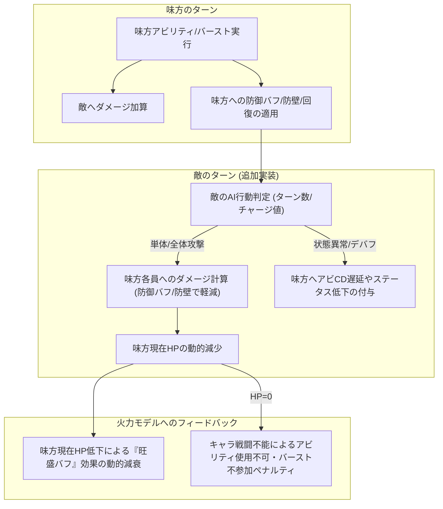

# 神姫PROJECT R — 包括的戦略指南 ＆ 開発ワークフローロードマップ

本ドキュメントは、バーストトラッカーを「包括的戦略指南シミュレーター」へ進化させる長期開発ロードマップ、および新キャラ追加コストを下げる「ハイブリッドワークフロー」の計画書です。人間とAIが共通の設計意志を持って開発を進められるように詳細を規定しています。

> [!NOTE]
> **現状（2026-06）**: Phase 2（エンジン汎用化）完了。**Phase 3（高速化）完了・クローズ**（Phase3-1/D/E/①-A＝2段ルート選抜まで実装し、実機で準備の劇的高速化を確認。詳細は [PERF_NOTES.md](./PERF_NOTES.md)、計画原本は [archive/PHASE3_PLAN.md](./archive/PHASE3_PLAN.md)）。WASM化は最終手段に降格。
> 現在は **Phase 4（実機較正の反復と最適押し順改善＝エンジンロジックの回収）** に着手中。
> **Phase 5（探索UX刷新＝待機画面の本格リニューアル・[archive/PHASE5_PLAN.md](./archive/PHASE5_PLAN.md)）** を新設（C9のBW128化で探索が重くなった緩和策）。
> **本書 §1 の長期ビジョン（敵行動・味方生存シミュレーション）は Phase 6 にリネーム**（旧Phase5・2026-06-28）。新キャラ導入ワークフロー構想も併記。`tools/add_character.js` 等の生成器は未実装の将来計画。
> **§1.3 に幻獣システム拡張（メイン/サブ幻獣効果・召喚時効果）を追記**（2026-06-30・Phase 6 ワークストリーム。受動スロット効果=軽量/需要駆動、能動召喚効果=Phase 6本体級。DB化必須）。

---

## 1. 長期ビジョン：包括的戦略指南シミュレーター（＝Phase 6）

現在の「木人形に対する火力最大化エンジン」から、**「敵の攻撃と特殊行動を想定し、味方の生存とバフ維持を両立させて最高スコアを出す戦略指南シミュレーター」**へと進化させます。

### 1.1 敵行動シミュレーションと味方生存モデルの全体像



### 1.2 進化ロードマップ

#### 【ステップ 1】敵行動定義のスキーマ化（data/enemies.js の拡張）
敵のパラメータ（防御値、最大HP）に加え、ターンごとの行動パターン（AI）を宣言的データで定義します。
- **データ構造案 (`enemies.js`)**:
  ```js
  const ENEMY_REGISTRY = {
    default_boss: {
      label: '汎用ボス', def: 10, max_hp: 100000000,
      charge_max: 3, // チャージターン（CT）
      actions: {
        normal: { type: 'single_attack', raw_dmg: 1500 }, // 通常ターン行動
        charge_attack: { // チャージMAX時の大技
          type: 'all_attack', raw_dmg: 5000,
          debuffs: [{ key: 'cd_delay', value: 1 }] // アビCD1ターン遅延
        }
      }
    }
  };
  ```

#### 【ステップ 2】味方HP概念と生存・防御シミュレーションの導入（class Sim の拡張）
味方キャラが防御能力を発揮し、被ダメージを管理するロジックをエンジンに配線します。
- **状態の拡張**: `this.hp = { edison: maxHp, ... }`（現在HP）および `this.shield = { edison: 0, ... }`（防壁値）の導入。
- **防御計算の配線**:
  - `sleur`（スリール）等の防壁アビが `sim.shield[target]` を加算。
  - `divinus` 等の敵攻撃DOWNデバフや、属性耐性バフが被ダメージを軽減。
  - 敵ターン終了時に `hp = hp - max(0, enemy_dmg - shield)` を処理。
- **旺盛バフへの影響反映**:
  - `_na()` 内の `vigor` 枠の計算において、現在の `Math.min(..., 1.0)`（常にフルHP前提）から、`vigor_coeff * (current_hp / max_hp)` による動的な旺盛減衰を適用。

#### 【ステップ 3】目的関数（_objective）への生存ペナルティの統合
- キャラが戦闘不能（HP=0）になった場合、探索エンジンのスコアリング（`_objective`）で致命的なペナルティを適用。
- 火力だけでなく「生存（10ターン完遂）」を最優先としつつ、回復アビリティを使用する最適なタイミングをビームサーチが自動判断するように誘導。

### 1.3 幻獣システムの拡張（メイン/サブ幻獣効果・召喚時効果）

メイン幻獣に編成して追加効果を発揮するキャラ、サブ幻獣で効果を発揮するキャラを正しく反映するための拡張。**実戦に近いシミュレーションへの一歩**（召喚時効果まで配線できれば再現度が大きく上がる）。設計相談の結論（2026-06-30）を Phase 6 ワークストリームとして記録する。

**現状**: `applyGear()` は幻獣2枠を区別せず集約し、`weapon_amp`（武器スキル枠倍率）と `box`（GEARボックス直加算）を反映するのみ。メイン/サブの位置セマンティクスは無い。前例として武器の `condition.mainOf`（メイン限定スキル）／キャラの `subAssists`（サブ**メンバー**アシスト集約）が既にあり、**今回はほぼ同型**。

**2層に切り分ける**:
- **(A) 受動スロット効果（メイン/サブ）= 軽量・優先度低**: 大半は押し順非依存の一律乗算バフ。GEAR/DMG（`applyGear`）に閉じ `class Sim` を触らない＝ホットパス・Worker抽出不変条件・golden に無関係。`applyGear` の幻獣ループに `i===0?mainEffect:subEffect` のゲートを足すだけ（武器 `isMain` と同型）。
- **(B) 能動「召喚時」効果 = 重め・Phase 6本体級**: 召喚（幻獣を能動的に呼ぶ）行動を**新アクションとして `class Sim` に導入**する必要がある（タイミング・CT依存＝押し順/最適化に絡む）。敵行動・味方生存モデル（§1.1）と同時期に扱うのが自然。

**DB配線（必須）**: エンジンにリテラルを書かない不変条件（CLAUDE.md §1）とメンテコストの両面から DB 化一択。`box`/`subAssists` の素直な拡張で対応：
```js
// SUMMON_REGISTRY エントリ拡張案（位置別効果を宣言）
someSummon: {
  jp:'…', elem:'light', weapon_amp:0, atk:…, hp:…,
  box:{ … },                                      // 位置非依存（従来どおり）
  mainEffect: { box:{ spec:0.20 }, condition:{ allElem:'light' } }, // メイン幻獣枠(slot0)のみ
  subEffect:  { box:{ assault:0.10 } },                            // サブ枠(slot>0)のみ
}
```
- 幻獣化する**神姫**は `CHAR_REGISTRY` に `asSummon:{mainEffect,subEffect}` を足して幻獣ドロップダウンへ合流＝**単一ソース原則**（キャラ定義1箇所で本体＋幻獣効果）。
- フレーム差動/誘発が要る幻獣キャラは既存汎用フック（`burstPartyPassive`/`onBurst`/`onAbility`）に流し Sim に分岐を足さない。
- Worker は `SUMMON_REGISTRY` を serialize 済み（`__FUNC__` 対応）＝**自動伝播**。
- golden 不変担保：新フィールドは該当幻獣未選択なら無効（既定値0／slot未選択）＝幻獣未設定のゴールデン編成に無影響。

**優先度の決め手**: (A) 受動・一律乗算効果は**序数比較/系統誤差で相殺**＝Phase 4 較正に不関与のため**後回し（需要駆動：その幻獣を使う段で1体分配線）**。例外として効果が**フレーム差動/誘発/CD系**（バーストダメ+X%・アビCD-1・バースト毎フラット等）の場合のみ押し順ランキングを変えるため、その幻獣に限り Phase 4 中でも安価に先行配線してよい。(B) 能動召喚効果は Phase 6 本体（敵行動・生存）と同期。

**残論点**: 幻獣スロットにメイン/サブの意味付けを与える小UI変更（slot0=メイン固定で十分）／`SUMMON_REGISTRY.atk/hp` は現状表示計算で未使用（死にフィールド）のため実stat配線か手動合計維持かの方針決め。

---

## 2. ハイブリッド型・半宣言的ワークフロー

新神姫や新幻獣を導入する際、チャットの往復コストを削減しつつ、固有の複雑なゲーム仕様（非定型ロジック）を100%表現できる記述形式を構築します。

### 2.1 構成：宣言的データ ＋ 命令的フックのハイブリッド

```js
// data/characters.js 内での将来的な新キャラ定義イメージ
  new_kamihime: {
    // ──────────────────────────────────────────
    // 1. 【宣言的データ】: UI自動生成や簡易追加が可能な範囲
    // ──────────────────────────────────────────
    type: 'kamihime', jp: '新神姫', elem: 'light', baseAtk: 8000,
    abilities: {
      abi1: ['y', 6, 0], // 黄アビ、CD 6、契晶0
      abi2: ['r', 5, 0],
    },
    // 標準的なバフ効果は記述子（Descriptor）だけで宣言的に動作（VMで処理）
    effects: {
      abi1: { type: 'party_buff', slot: 'assault', value: 0.20, duration: 3 } 
    },
    // ──────────────────────────────────────────
    // 2. 【命令的フック】: 複雑な固有ギミック・ニュアンスの表現
    // ──────────────────────────────────────────
    def: {
      // 複雑なバースト効果や割り込みはJS関数で記述し、エジェントが個別に調整
      onBurst: (sim, atk) => {
        if(sim.state_x > 2) {
          sim.cd.abi2 = 0; // 条件付きCDリセット
        }
      }
    }
  }
```

### 2.2 開発ワークフロー（導入手順）

1. **基本アクションのVM化 (Phase 3)**:
   - エンジン側にアサルトバフ付与、ゲージ増加、ダメージ計算などの標準アクションをバイトコードで実行する VM ループを実装し、アビリティ全体の6割以上を「宣言的データ（`effects` 記述）」だけで動作可能にします。
2. **コードジェネレーターの整備**:
   - 人間が簡易的なアビリティ仕様テキストを渡すと、この JSON 宣言とフック関数を自動生成して `data/characters.js` の末尾に自動追記するスクリプト（またはプロンプトテンプレート）を `tools/add_character.js` として作成。
   - これにより、チャットコストを「仕様テキストの提示 → 1回の自動コード追記とテスト」のみに削減しつつ、固有ニュアンスの柔軟性を残します。

---

## 3. Phase 4：実機較正の反復と最適押し順改善（継続フェーズ）

シミュレーターが実用速度と汎用構造を備えた現在、今後の主戦場は**「実機上の実際のダメージ推移や行動順と、シミュレーターの探索ロジックのズレを解消し、徹底的かつ精確に較正し続けること（Phase 4）」**になります。

### 3.1 改善プロセスとエージェント連携フロー
不整合や「最適でない押し順」が発見された際は、コンテキストの肥大化を防ぐために以下の「ドキュメント駆動フロー（[CLAUDE.md](file:///c:/Users/Kanta%20Miyanaga/kamipro/CLAUDE.md) §4 および [AGENTS.md](file:///c:/Users/Kanta%20Miyanaga/kamipro/.agents/AGENTS.md) §3）」にのっとって修正を進めます。

1. **再現リプレイの作成**: [index.html](file:///c:/Users/Kanta%20Miyanaga/kamipro/index.html) の「🎬 リプレイモード」を使用し、実機とシミュレータのズレの起点（ターン・バフ・ロボ・ダメージ等）を特定。
2. **課題のドキュメント化**: 乖離の詳細（対象キャラ/アビ/ターン/実機挙動/シム誤挙動）を [CALIBRATION_ANALYSIS.md](file:///c:/Users/Kanta%20Miyanaga/kamipro/CALIBRATION_ANALYSIS.md) に追記。
3. **計画・検証策定（Antigravity）**: 設計エージェントが不整合の原因（パラメータ較正不足や状態遷移バグ）を特定し、`simulation/simNN/design_report.md` を**必須5節構成**（総合比較/敗北要因/乖離分析/影響度検証/引継ぎ）で作成して再現テストケースを定義。
4. **自律修正とテスト（Claude Code）**: 実装エージェントが `design_report.md` を検証して `simNN/integrated_analysis.md` にまとめ、コードを修正し、テストを実行。基準値（`175,023,298`）と新規アサートの双方を検証して完了。

### 3.2 較正・改善の泥沼への心構え
アビリティ押し順やダメージ計算式は、ゲームのアップデートや新たな検証データによって常に更新される動的なものです。
* パラメータの追加変更は必ず [data/characters.js](file:///c:/Users/Kanta%20Miyanaga/kamipro/data/characters.js) の `CHAR_REGISTRY` への宣言的記述として行い、エンジン部（[index.html](file:///c:/Users/Kanta%20Miyanaga/kamipro/index.html) の `Sim` 構造）への個別ハードコードを排除し続けること。
* 高速化された探索エンジンをベースに、期待値の整合性を担保しながら一歩一歩安全に較正を進めること。
