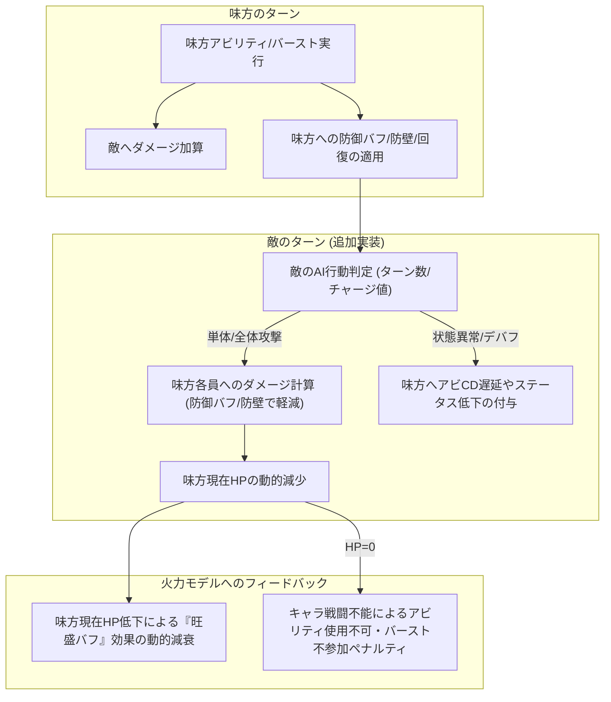

# 神姫PROJECT R — 開発ロードマップ ＆ Phase 一覧

バーストトラッカーを「包括的戦略指南シミュレーター」へ進化させる長期開発計画と、Phase の採番・スコープを管理する台帳。
各 Phase の**詳細計画は個別ドキュメント**（`PHASE4_PLAN.md`・`KILL_TURN_DESIGN.md` 等）が一次情報。本書は**全体像とPhase境界**を規定する。

> [!NOTE]
> **Phase 体系 再編（2026-07-09）**: 旧「Phase 6＝将来展望の総まとめ」を実装単位へ細分化した。
> - **Phase 6 = 幻獣システム拡張**（メイン/サブ幻獣・召喚時効果）＝単独化。
> - **Phase 7 = アクセサリー実装** → **（2026-07-15 差替）Phase 8 へ繰り下げ**。
> - 旧 Phase 6 の残り（敵行動・味方生存／最速撃破モード／VM・ワークフロー）は **未確定Phase**（採番待ち）へ退避。
>
> **採番改訂（2026-07-15・ユーザー決定）**: **Phase 7 = 静的スコア s の機械学習化**（大規模Phase・新設・一次情報
> `PHASE7_ML_PLAN.md`）。従来の**アクセサリー実装は Phase 8 へ繰り下げ**（内容不変・本書 §3.5）。
>
> 番号は着手順ではなく識別子。Phase 5（UX刷新）が Phase 6 より先に完了する等、番号と時系列は前後する。

---

## 0. Phase 一覧（現状マップ）

| Phase | 内容 | 状態 | 一次情報 |
|---|---|---|---|
| 1 | 初期ビルド（火力計算＋UI） | 完了 | — |
| 2 | エンジン汎用化（`CHAR_REGISTRY` 単一ソース化） | 完了・クローズ | `archive/PHASE2_PLAN.md` |
| 3 | 高速化（アロケフリー / clone / ①-A 2段ルート選抜） | 完了・クローズ | `archive/PHASE3_PLAN.md`・`archive/PERF_NOTES.md` |
| **4** | **実機較正の反復＋最適押し順改善** | **← 現行フェーズ** | `PHASE4_PLAN.md`・`CALIBRATION_ANALYSIS.md` |
| 5 | 探索UX刷新（待機画面）＋ Vite/ESM 化 | 完了・クローズ | `archive/PHASE5_PLAN.md`・`archive/VITE_MIGRATION.md` |
| **6** | **幻獣システム拡張**（メイン/サブ・召喚時効果） | 未着手（設計骨子あり・本書 §2） | 本書 §2 |
| **7** | **静的スコア s の機械学習化**（探索ヒューリスティックの学習最適化） | 未着手・検討フェーズ（**大規模Phase**・2026-07-15 新設） | `PHASE7_ML_PLAN.md`・本書 §3 |
| **8** | **アクセサリー実装**（新規装備系統） | 未着手（本書 §3.5・**詳細は次セッション**） | 本書 §3.5 |
| 未確定 | 敵行動・味方生存 ／ 最速撃破 ／ VM・ワークフロー | 採番待ち（本書 §4） | 本書 §4・`KILL_TURN_DESIGN.md` |

**現行ゴールデン値**: raw `187,186,834` / calibrated `208,689,608`（C27 赤アビ後出しリファイン・2026-07-14。検証は `npm run test:golden`）。

---

## 1. 現行フェーズ：Phase 4（実機較正）

シムの探索ロジック・ダメージモデルと**実機**の乖離を、ドキュメント駆動フロー（CLAUDE.md §4 / .agents/AGENTS.md §3）で
一つずつ回収する。**主目標＝押し順（行動順）の実機一致**、絶対値一致は二次。進め方・方針の台帳は **`PHASE4_PLAN.md`**、
確定値と乖離バックログ（Cx）は **`CALIBRATION_ANALYSIS.md`** が一次情報。

- 較正カデンツ＝turn-by-turn ホライズン（sim01=T1確定 → sim02=T2 進行中）。
- Phase 6/8 の要素（敵DB化等）が**較正に正のフィードバックを与えると判明した場合は前倒し一括着手も排除しない**
  （前例: 較正ボス `walpurgis_loki` 1体のみを Phase 6 から前倒しで敵DB化・`PHASE4_PLAN.md` §7）。

---

## 2. Phase 6：幻獣システム拡張（メイン/サブ幻獣効果・召喚時効果）

> [!NOTE]
> **実装ステータス（2026-07-10）**
> - ✅ **(A) 受動スロット効果の骨格＝実装済み（main へマージ済み）**: 幻獣2枠→**7枠（メイン1+サブ5+サポート1・重複可）**へ拡張。
>   `SUMMON_LAYOUT`/`SUMMON_ROLES`（`src/app.js`）でスロット区分を定義し、`applyGear` が **main/support→`mainEffect`（加護 weapon_amp 含む）・
>   sub→`subEffect` のみ（加護禁止）** をゲート。DB は `weapon_amp`/`box` を `mainEffect` 配下へ移設済み（`data/summons.js`）。旧length-2
>   プリセットは加護保存のためサポート枠へ移行。golden 不変（raw 195,518,168 / calibrated 212,010,783）・build成功・7枠UI/区分ゲートを実測検証済み。
> - ⬜ **残タスク**:
>   1. **サブ幻獣効果（`subEffect`）を持つ幻獣の実DB登録**: 構造は配線済み＝該当幻獣が出た段でエントリに `subEffect:{box:{…}}` を足すだけ。
>   2. **stat 自動合計**: 現状は手動合計入力を維持。DB `atk/hp` からの自動合計に切替える場合は**サポート枠を合計から除外**するゲートが必要。
>   3. **(B) 召喚時効果（能動召喚アクション）**: `class Sim` 改修を要する重い拡張。下記 (B) のとおり敵行動・生存モデル（§4-i）と同期の別Phaseへ据え置き。

メイン幻獣に編成して追加効果を発揮するキャラ、サブ幻獣で効果を発揮するキャラを正しく反映する拡張。
**実戦に近いシミュレーションへの一歩**（召喚時効果まで配線できれば再現度が大きく上がる）。設計相談の結論（2026-06-30）＋
**実機仕様の確定（2026-07-10）**を記録する。

**実機の幻獣構成（確定・2026-07-10）**: 編成は **メイン幻獣1体 ＋ サブ幻獣5体 ＋ サポート幻獣1体（フレンドの幻獣）** の計7体。
効果の発動可否とstat寄与はスロット区分で決まる：

| 区分 | 体数 | メイン幻獣効果<br>(weapon_amp＝ウェポンスキル効果量UP を含む) | サブ幻獣効果 | 召喚時効果 | HP/ATK表示合計への寄与 |
|---|---|---|---|---|---|
| メイン | 1 | ○ | — | ○ | ○ |
| サポート（フレンド） | 1 | ○ | — | ○ | **✕** |
| サブ | 5 | **✕** | ○（あれば） | ○ | ○ |

- **weapon_amp（加護＝ウェポンスキル効果量UP）はメイン幻獣効果の一種**。∴ 発動できるのは**メイン＋サポートの2枠のみ**で、サブ5体は出せない。
- 表示のHP/攻撃力＝**メイン＋サブ（6体）の合計**。**サポート幻獣のstatは表示合計に含まれない**（効果だけ乗る）。サブ5体分のstatは現状**手動合計入力**に畳まれている。
- 召喚時効果は**全7体が保持**（区分不問）。

**現状の実装マッピング**: `applyGear()` は幻獣2枠を区別せず集約し、`weapon_amp`（武器スキル枠倍率）と `box`（GEARボックス直加算）を反映するのみ
（メイン/サブの位置セマンティクスは無い）。ただし**現行2枠がともに `weapon_amp` を加算する構造は、実機の「メイン枠＋サポート枠＝2加護源」に
ちょうど対応しており正しい**（サブ5体は加護を出さないため2枠に留めているのは実機整合）。前例として武器の `condition.mainOf`（メイン限定スキル）／
キャラの `subAssists`（サブ**メンバー**アシスト集約）が既にあり、位置別ゲートは**ほぼ同型**。

> [!IMPORTANT]
> **スロット意味付けの改訂**: 旧記述の `slot0=メイン` / `slot>0=サブ` の2分類は誤り。正しくは **`メイン枠 / サポート枠`（＝mainEffectゲート・weapon_amp可・
> サポートはstat非寄与）** と **`サブ枠`（＝subEffectゲート・**weapon_amp禁止**・stat寄与）** の3意味付け。
> **現行モデルの残ギャップ**: サブ枠固有の「サブ幻獣効果（box）」は現行2枠モデルに表現手段が無い（両枠ともメイン加護扱い）。サブ幻獣効果を持つ幻獣を
> 配線する段で、サブ枠（stat専用＋subEffect box・weapon_amp禁止）を別途足す必要がある。

**2層に切り分ける**:
- **(A) 受動スロット効果（メイン/サポート/サブ）= 軽量・優先度低**: 大半は押し順非依存の一律乗算バフ。GEAR/DMG（`applyGear`）に閉じ
  `class Sim`（`src/sim.js`）を触らない＝ホットパス・Worker抽出不変条件・golden に無関係。`applyGear` の幻獣ループに
  **スロット区分ゲート**（`main`/`support`→`mainEffect`＋weapon_amp可、`sub`→`subEffect`のみ・weapon_amp禁止）を足すだけ（武器 `isMain` と同型）。
- **(B) 能動「召喚時」効果 = 重め・未確定Phase(敵行動・生存)級**: 召喚（幻獣を能動的に呼ぶ）行動を**新アクションとして
  `class Sim` に導入**する必要がある（タイミング・CT依存＝押し順/最適化に絡む）。敵行動・味方生存モデル（§4-i）と同時期に扱うのが自然。

**DB配線（必須）**: エンジンにリテラルを書かない不変条件（CLAUDE.md §1）とメンテコストの両面から DB 化一択。
`box`/`subAssists` の素直な拡張で対応：
```js
// SUMMON_REGISTRY エントリ拡張案（スロット区分別効果を宣言）
someSummon: {
  jp:'…', elem:'light', atk:…, hp:…,
  box:{ … },                                       // 位置非依存（従来どおり）
  mainEffect: {                                    // メイン枠 or サポート枠でのみ発動
    weapon_amp:0.50,                               // ← 加護（ウェポンスキル効果量UP）はメイン幻獣効果。∴ここに宿す
    box:{ spec:0.20 }, condition:{ allElem:'light' },
  },
  subEffect:  { box:{ assault:0.10 } },            // サブ枠でのみ発動（weapon_amp はここに書かない）
}
```
※ **weapon_amp は `mainEffect` 配下へ移す**のが実機整合（サブ枠選択時に加護が乗らないことを構造で保証）。既存 `SUMMON_REGISTRY` の
トップレベル `weapon_amp`（守護0.40等）は移行時に `mainEffect.weapon_amp` へ寄せる。
- 幻獣化する**神姫**は `CHAR_REGISTRY` に `asSummon:{mainEffect,subEffect}` を足して幻獣ドロップダウンへ合流＝**単一ソース原則**。
- フレーム差動/誘発が要る幻獣キャラは既存汎用フック（`burstPartyPassive`/`onBurst`/`onAbility`）に流し Sim に分岐を足さない。
- Worker は `SUMMON_REGISTRY` を serialize 済み（`__FUNC__` 対応）＝**自動伝播**。
- golden 不変担保：新フィールドは該当幻獣未選択なら無効（既定値0／slot未選択）＝幻獣未設定のゴールデン編成に無影響。

**優先度の決め手**: (A) 受動・一律乗算効果は**序数比較/系統誤差で相殺**＝Phase 4 較正に不関与のため**後回し（需要駆動：
その幻獣を使う段で1体分配線）**。例外として効果が**フレーム差動/誘発/CD系**（バーストダメ+X%・アビCD-1・バースト毎フラット等）の
場合のみ押し順ランキングを変えるため、その幻獣に限り Phase 4 中でも安価に先行配線してよい。
(B) 能動召喚効果は敵行動・生存モデル（§4-i）と同期。

**UI方針（確定・2026-07-10）**: 神姫と同様に幻獣を `SUMMON_REGISTRY` へ複数DB登録し、**編成内容に応じてプルダウンで選択**する
（最もユーザーフレンドリー）。スロットは `メイン枠 / サポート枠 / サブ枠×5` の意味付けを持たせる（現行2枠→メイン＋サポートへ再ラベル、
サブ枠は subEffect 配線の段で追加）。**⚠ 同一幻獣の複数編成を許す**（実機で同じキャラを複数体編成可）＝スロット選択は
**重複可**の構造にする（現行 `summon-i` プルダウンが既に重複可・キー配列で保持している方向を踏襲）。

**残論点**: `SUMMON_REGISTRY.atk/hp` は現状表示計算で未使用（死にフィールド）＝実stat配線（プルダウン選択から自動合計）か
手動合計維持かの方針決め（サポート枠はstat非寄与のため合計から除外するゲートが要る）。

---

## 3. Phase 7：静的スコア s の機械学習化（新規・大規模Phase）

**状態: 検討フェーズ（2026-07-15 起票）**。**一次情報は `PHASE7_ML_PLAN.md`**（レベルA/B/C 吟味・レベルA PoCハーネス設計）。
本書は境界のみ規定する。

- **狙い**: 探索の既定ポリシー／タイブレークに使う**静的スコア `s`（直書き定数）**を、機械学習／連続最適化で fit した
  値へ置換し、ビームがより良い実ルートを取りこぼさないようにする。`s` は**ダメージ非関与**（実ダメージは押し順のみで決定）
  ＝改善対象は「ロールアウト近似の質」。
- **⚠ スコープ外**: 実機**絶対値乖離**（C25/C5 等）は**ダメージ式**の問題で本Phaseでは改善しない（混同注意）。
- **レベル分け**（詳細 `PHASE7_ML_PLAN.md` §2）:
  - **A（推奨着手）**: 既存スコアの重み/定数をオフライン最適化・JSは線形/定数のまま＝**ホットパス不変**（2〜4人日）。
  - **B**: 極小GBDT/MLP を既定ポリシーに（1.5〜3週・**ホットパス性能が本命ゲート**）。
  - **C**: ビームをRL方策で置換（数ヶ月・非推奨・記録のみ）。
- **不変条件**: 既定＝現行定数と完全一致（inert-by-default）で golden 不変／採用時のみ Cx 再fit／単調安全（現行以上でのみ採用）／
  タグ駆動でキャラ名リテラル不使用。
- **次アクション**: **レベルA（A2）PoCハーネス**（`tools/ml_fit_static.mjs`・`setStaticOverride` 流用・本体非改変で上限測定）で
  Go/No-go 判定（`PHASE7_ML_PLAN.md` §4）。

---

## 3.5 Phase 8：アクセサリー実装（新規・詳細は次セッションで策定）

**状態: プレースホルダ（2026-07-09 起票・詳細未策定。2026-07-15 に旧 Phase 7 から Phase 8 へ繰り下げ）**。新装備系統
「アクセ（アクセサリー）」をシミュレーションに反映する。

- **想定**: 現状の装備モデルは幻獣2枠＋ウェポンスキル合計を `applyGear()` が GEAR ボックス（`assault`/`elem`/`vigor`/…）へ
  集約する構造。アクセも**押し順非依存の常時ボックス補正**が主なら、幻獣/武器と同じく `applyGear` への集約で `class Sim` を
  触らず入る可能性が高い（＝Phase 6(A) と同系統の軽量拡張）。フレーム差動/誘発/CD系の効果を持つ場合のみ押し順に絡む。
- **次セッションで詰める点**: ①アクセの効果種別の棚卸し（一律乗算か・フレーム差動か・発動系か）②UI枠（何枠・どの編成単位か）
  ③DBスキーマ（新規 `ACCESSORY_REGISTRY` か既存 GEAR 拡張か）④golden不変担保の方針（未装備で無影響）。

---

## 4. 未確定Phase（採番待ち・次セッション以降で優先度と番号を確定）

旧 Phase 6（将来ビジョンの総まとめ）から細分化して退避した3ワークストリーム。着手順・番号は未定。

### (i) 敵行動シミュレーションと味方生存モデル
現在の「木人形に対する火力最大化エンジン」から、**「敵の攻撃と特殊行動を想定し、味方の生存とバフ維持を両立させて
最高スコアを出す戦略指南シミュレーター」**へ進化させる、最大規模のワークストリーム。



**進化ステップ（草案）**:
1. **敵行動定義のスキーマ化（`data/enemies.js` 拡張）**: 防御値・最大HPに加え、ターンごとの行動パターン（AI）を宣言的
   データで定義（`charge_max`／`actions.normal`／`actions.charge_attack` に `type`・`raw_dmg`・`debuffs`）。
   ※較正ボス `walpurgis_loki` の2フェーズ被ダメ倍率（**C7** deferred）はこのスキーマの最初の実顧客になる。
2. **味方HP概念と生存・防御の導入（`class Sim` 拡張）**: `this.hp`/`this.shield` 追加。`sleur` 等の防壁が `shield` 加算、
   `divinus` 等の攻撃DOWN・属性耐性で被ダメ軽減、敵ターン終了時に `hp -= max(0, enemy_dmg - shield)`。
   `_na()` の `vigor` 枠を現在HP比で動的減衰（現状の常時フルHP前提を撤廃）。
3. **目的関数（`_objective`）への生存ペナルティ統合**: HP=0 で致命ペナルティ。火力だけでなく「生存（Nターン完遂）」を
   最優先しつつ、回復タイミングをビームサーチが自動判断するよう誘導。

### (ii) 最速撃破モード（kill-turn 自動目標）
ターン数指定を「選択した敵を最速で倒す」自動目標へ置き換える構想。**設計・検討は `KILL_TURN_DESIGN.md` が一次**。
現状の結論（§7）: 演算量は非障害・**真のブロッカーは絶対値精度（実機比×2級）**。S3（目的関数のkill化）は保留、
S1+S2（フェーズ倍率モデル化＋撃破ターン表示）は **sim02 試行2 の絶対乖離実測をゲート**に着手判断。
→ (i) の敵HPフェーズ倍率（C7）モデル化と依存を共有するため、(i) と同期させるのが自然。

### (iii) ハイブリッド型・半宣言的ワークフロー（新キャラ/新システム導入コスト削減）
新神姫・新幻獣・アクセ等の導入時のチャット往復コストを削減しつつ、固有の複雑なゲーム仕様を100%表現できる記述形式。

- **構成**: 宣言的データ（`effects` 記述子）＋命令的フック（複雑ギミックはJS関数）のハイブリッド。標準アクション
  （アサルトバフ付与・ゲージ増加・ダメージ計算等）を**VMループ**で実行し、アビの6割以上を宣言的データだけで動作可能にする。
- **コードジェネレータ構想**: 簡易仕様テキスト → JSON宣言＋フック関数を自動生成し `data/characters.js` へ追記する
  `tools/add_character.js`（未実装）。チャットコストを「仕様提示 → 1回の自動コード追記＋テスト」へ削減する。
- 効果が出るのは**新キャラ/新システムの導入頻度が上がった段階**（Phase 6/8 の実キャラ配線が本格化する頃）。

---

## 5. 新キャラ導入の現行ルール（ワークフロー整備前の暫定）

VM/ジェネレータ（§4-iii）が入るまでは、**`CHAR_REGISTRY`（`data/characters.js`）への宣言的記述＋汎用フック**で追加する
（CLAUDE.md §1 の不変条件を厳守）。エンジン本体（`class Sim`）にキャラ名リテラルを書かない。パラメータ変更は必ず DB 側で行い、
`npm run test:golden` でゴールデン一致を担保しながら一歩ずつ進める。
