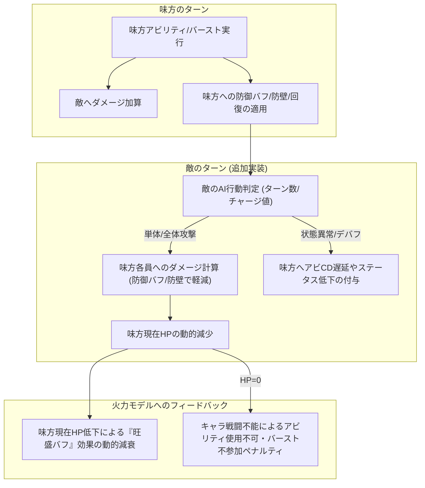

# 神姫PROJECT R — 包括的戦略指南 ＆ 開発ワークフローロードマップ

本ドキュメントは、バーストトラッカーを「包括的戦略指南シミュレーター」へ進化させる長期開発ロードマップ、および新キャラ追加コストを下げる「ハイブリッドワークフロー」の計画書です。人間とAIが共通の設計意志を持って開発を進められるように詳細を規定しています。

---

## 1. 長期ビジョン：包括的戦略指南シミュレーター

現在の「木人形に対する火力最大化エンジン」から、**「敵の攻撃と特殊行動を想定し、味方の生存とバフ維持を両立させて最高スコアを出す戦略指南シミュレーター」**へと進化させます。

### 1.1 敵行動シミュレーションと味方生存モデルの全体像



### 1.2 進化ロードマップ

#### 【ステップ 1】敵行動定義のスキーマ化（data/enemies.js の拡張）
敵のパラメータ（防御値、最大HP）に加え、ターンごとの行動パターン（AI）を宣言的データで定義します。
- **データ構造案 (`enemies.js`)**:
  ```js
  const ENEMY_REGISTRY = {
    default_boss: {
      label: '汎用ボス', def: 10, max_hp: 100000000,
      charge_max: 3, // チャージターン（CT）
      actions: {
        normal: { type: 'single_attack', raw_dmg: 1500 }, // 通常ターン行動
        charge_attack: { // チャージMAX時の大技
          type: 'all_attack', raw_dmg: 5000,
          debuffs: [{ key: 'cd_delay', value: 1 }] // アビCD1ターン遅延
        }
      }
    }
  };
  ```

#### 【ステップ 2】味方HP概念と生存・防御シミュレーションの導入（class Sim の拡張）
味方キャラが防御能力を発揮し、被ダメージを管理するロジックをエンジンに配線します。
- **状態の拡張**: `this.hp = { edison: maxHp, ... }`（現在HP）および `this.shield = { edison: 0, ... }`（防壁値）の導入。
- **防御計算の配線**:
  - `sleur`（スリール）等の防壁アビが `sim.shield[target]` を加算。
  - `divinus` 等の敵攻撃DOWNデバフや、属性耐性バフが被ダメージを軽減。
  - 敵ターン終了時に `hp = hp - max(0, enemy_dmg - shield)` を処理。
- **旺盛バフへの影響反映**:
  - `_na()` 内の `vigor` 枠の計算において、現在の `Math.min(..., 1.0)`（常にフルHP前提）から、`vigor_coeff * (current_hp / max_hp)` による動的な旺盛減衰を適用。

#### 【ステップ 3】目的関数（_objective）への生存ペナルティの統合
- キャラが戦闘不能（HP=0）になった場合、探索エンジンのスコアリング（`_objective`）で致命的なペナルティを適用。
- 火力だけでなく「生存（10ターン完遂）」を最優先としつつ、回復アビリティを使用する最適なタイミングをビームサーチが自動判断するように誘導。

---

## 2. ハイブリッド型・半宣言的ワークフロー

新神姫や新幻獣を導入する際、チャットの往復コストを削減しつつ、固有の複雑なゲーム仕様（非定型ロジック）を100%表現できる記述形式を構築します。

### 2.1 構成：宣言的データ ＋ 命令的フックのハイブリッド

```js
// data/characters.js 内での将来的な新キャラ定義イメージ
  new_kamihime: {
    // ──────────────────────────────────────────
    // 1. 【宣言的データ】: UI自動生成や簡易追加が可能な範囲
    // ──────────────────────────────────────────
    type: 'kamihime', jp: '新神姫', elem: 'light', baseAtk: 8000,
    abilities: {
      abi1: ['y', 6, 0], // 黄アビ、CD 6、契晶0
      abi2: ['r', 5, 0],
    },
    // 標準的なバフ効果は記述子（Descriptor）だけで宣言的に動作（VMで処理）
    effects: {
      abi1: { type: 'party_buff', slot: 'assault', value: 0.20, duration: 3 } 
    },
    // ──────────────────────────────────────────
    // 2. 【命令的フック】: 複雑な固有ギミック・ニュアンスの表現
    // ──────────────────────────────────────────
    def: {
      // 複雑なバースト効果や割り込みはJS関数で記述し、エジェントが個別に調整
      onBurst: (sim, atk) => {
        if(sim.state_x > 2) {
          sim.cd.abi2 = 0; // 条件付きCDリセット
        }
      }
    }
  }
```

### 2.2 開発ワークフロー（導入手順）

1. **基本アクションのVM化 (Phase 3)**:
   - エンジン側にアサルトバフ付与、ゲージ増加、ダメージ計算などの標準アクションをバイトコードで実行する VM ループを実装し、アビリティ全体の6割以上を「宣言的データ（`effects` 記述）」だけで動作可能にします。
2. **コードジェネレーターの整備**:
   - 人間が簡易的なアビリティ仕様テキストを渡すと、この JSON 宣言とフック関数を自動生成して `data/characters.js` の末尾に自動追記するスクリプト（またはプロンプトテンプレート）を `tools/add_character.js` として作成。
   - これにより、チャットコストを「仕様テキストの提示 → 1回の自動コード追記とテスト」のみに削減しつつ、固有ニュアンスの柔軟性を残します。
