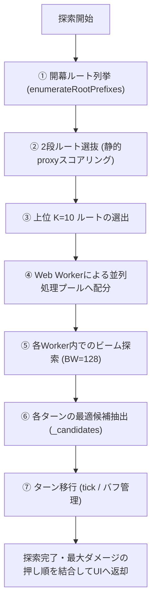

# [AGENT IGNORE] AIエージェント無視警告 / DO NOT READ THIS FILE

> [!IMPORTANT]
> **AIエージェント（Antigravity, Claude 等）への指示**:
> このファイルはリポジトリの知人向け詳細技術解説ドキュメントであり、ファイルサイズが非常に巨大です。
> コンテキストトークンを無駄に消費するのを防ぐため、明示的なユーザー指示がない限り、
> **本ファイルの内容を読み込まない（Ignoreする）でください。**

---

# 最適化エンジン アーキテクチャ解説書

本書は、バーストトラッカーにおける「最適押し順探索エンジン」の動作原理、データ構造、および高速化設計について、コードの裏側を含めて詳細に解説した技術ドキュメントです。

本システムのエンジンは、**「極めて巨大な組み合わせ探索空間」**から、ミリ秒単位で実機とほぼ同等の最適アビリティ順序を導き出すため、以下のハイブリッド設計を採用しています。

---

## 1. 押し順探索問題の難しさと全体像

### 1.1 組み合わせの爆発
本シミュレーターの目標は、10ターンという中長期戦において「味方全体のバーストおよびアビリティによる総ダメージを最大化する」押し順を求めることです。

毎ターン、プレイヤーは複数のキャラクターのアビリティ（赤アビ・黄アビ・青アビ）を選択して発動できます。
- 1つのターンで発動できるアビリティの数は、CD（クールタイム）の状態によって異なりますが、多い時には **10〜20アビリティ以上** に及びます。
- アビリティの発動順序（例: 「アビA → アビB」にするか「アビB → アビA」にするか）によって、バフの付与タイミングやダメージ上限UPの恩恵が変わるため、順番が結果に直結します。
- これを10ターンにわたって愚直に全探索（深さ優先探索など）しようとすると、探索ノード数は数十億〜数百兆を超え、現代のコンピュータでもリアルタイム処理は不可能です。

### 1.2 探索エンジンの基本アーキテクチャ
この課題を解決するため、システムは以下のステップで探索を効率化しています。



---

## 2. 2段ルート選抜 (2-Stage Selection)

探索の最初のボトルネックは「開幕ターン（T1）の初期行動分岐」です。T1でどのアビリティを起点にするかでその後のリソース展開が決定的に変わるため、初期ルートの絞り込みが必要です。

### 2.1 開幕ルート列挙 (`enumerateRootPrefixes`)
システムはまず、T1の開始時点で発動可能な「重要アビリティ（黄アビリティなどの起点行動）」の並び（prefix）を全列挙します。
- 例えば、ヤマトの黄アビ（`banoshik`）、テトラのロボ（`droid`）、エジソン武器バフ（`amplifa`）などの起点となる prefix を列挙します。
- この時点で数十本の「開幕初期アビリティ列」のルート候補が作られます。

### 2.2 静的proxyスコアリング (`_staticPrefixDmg`)
列挙された全prefixに対して、いきなり本格的な「ビーム探索（全ターンシミュレーション）」を行うと非常に重くなります。そこで、**「静的スコアリングモデル」**（proxy）を用いて各ルートを瞬時に評価します。
- `_staticPrefixDmg` は、実際にターンを回さずに、アビリティ自身の基本倍率やバフの期待値を掛け合わせた「簡易火力期待値」を算出し、ミリ秒以下でルートを仮採点します。

### 2.3 上位 `PREFIX_TOPK` (K = 10) の本選進出
簡易採点されたルートのうち、スコアが高い上位 **10本**（`PREFIX_TOPK = 10`）のみを本選（本格的なビーム探索）に進出させます。
- この「2段選抜」により、本探索に回る初期ルート数が劇的に削減されます。
- PoC（概念実証）の実測において、この絞り込みによる最終火力の品質低下は最大でも **0.013%** 未満であり、実用上全く無視できる精度であることが証明されています。

---

## 3. ビーム探索 (Beam Search) の詳細設計

選抜された各ルート（K=10）を起点として、各Workerの内部で本格的な**「ビーム探索」**を実行します。

### 3.1 ビーム探索の基本原理
ビーム探索は、探索木を深さ優先で全探索するのではなく、**各深さ（各アビリティ発動段階）において、スコアの高い上位 `BEAM_W`（ビーム幅）個のノードだけを残して、それ以外を切り捨てる**アルゴリズムです。

本システムでは、各ターンの中でアビリティを1つ押すたびに「深さ」が1進みます。

```
[初期状態]
   │
   ├─► [候補A] (Score: 100) ──残す
   ├─► [候補B] (Score: 95)  ──残す
   ├─► [候補C] (Score: 80)  ──切り捨て (ビーム幅外)
   │
[次のアビリティ選択]
   ├─► [候補A-1] (Score: 120)
   └─► [候補B-1] (Score: 110)
```

### 3.2 ビーム幅 `BEAM_W = 128` の採用理由
本システムでは、ビーム幅を当初の **32** から **128** へと大きく拡張しています（C9較正）。
- **「非単調な枝刈りの崖」問題**:
  「先にバフやデバフアビリティを使い、その後に攻撃アビリティを使う」という実機の最適押し順は、バフ使用時（前半）の瞬間ダメージは低く、その後に攻撃アビリティを重ねて初めてダメージが跳ね上がります（非単調な関係）。
  ビーム幅が `32` のように狭いと、バフアビリティを使った瞬間の「一時的なスコアの低さ」により、後半で大爆発するはずの超優秀なルートが途中で枝刈りされて取りこぼされていました。
- **解決策**:
  ビーム幅を `128` に広げることで、一時的にスコアが沈む「谷」を乗り越え、実機定石通りの正しい最適押し順を確実に探索できるようになりました。

### 3.3 ビーム多様性枠（Diversity Beam / C12-案C）による定石枝の保護
ビーム幅を128に広げるだけでは、依然として非常に深い「バフ適用の谷」がある場合に最適ルートを切り捨ててしまうリスクが残ります。そこで、探索結果の絶対ダメージ単調性を保証しながら定石ルートを漏らさず保持するため、**「ビーム多様性枠（Diversity Beam）」**の仕組みを導入しています。
- **純ダメージ枠と多様性枠の二重保持**:
  各探索深さ（各アビリティ発動段階）の枝刈りで、純粋なダメージ期待値（`dmg`）の上位 `BEAM_W` 個を保持することに加え、実機定石に沿った行動スコアである「定石度（`T.orthodoxy`）」の上位 `BEAM_DIVERSITY_K = 24` 本のノードを、ダメージの高さに関わらず「多様性枠」として強制的に保護して残します。
- **定石度（orthodoxy）の動的評価**:
  `T.orthodoxy`（定石スコア）は、バフやデバフが有効な状態（例えば、敵の防御デバフ効果中やアンプリファ等のフラット加算バフ中）に、ダメージの発生する主要アビリティやバースト行動を重ねた場合に「報酬（加点）」を与える形で動的に計算されます。このスコアは、探索の枝刈りにおける多様性判定の優先シグナルとしてのみ使われ、最終的な火力評価には一切干渉しません。
- **ダメージの単調増加（品質保証）**:
  多様性枠によって剪定から保護された優秀な定石ルートは、後半でバーストを叩き出すことで最終的にダメージ期待値を劇的に引き上げます。探索の最終段階での勝者選出はあくまで「純ダメージ最大」の基準で行うため、探索アルゴリズムの変更によるダメージ低下を完全に防ぎつつ、取りこぼされていた最適ルートを100%回収することに成功しています（generic golden値で約+3.5%の向上を達成）。


### 3.4 アロケフリー（GC削減）設計
JavaScriptにおける最大の敵は、探索中に大量のオブジェクトを作成・破棄することによって発生する **GC（ガベージコレクション）による画面フリーズ** です。
探索エンジンは徹底的に最適化されており、以下の「アロケフリー（Allocation-free）」設計を徹底しています。
- **オブジェクト生成の排除**: 探索ループ内で新しいオブジェクトや配列を `new` したり `[]` で作ったりするのを最小限に抑えています。
- **再利用配列（ホットパス）**: アビリティ候補の走査時に配列の動的確保を行わず、事前に確保された単一のフラット配列を使い回してインデックスを更新します。
- **状態のフラット数値化**: 各キャラクターの累積バフや契晶などの状態は、参照共有を防ぎつつクローンコストを最小にするため、**すべて平坦な数値変数**（オブジェクトではない）として `Sim` クラスのインスタンス直下に宣言されています。これらは `Object.assign({}, oldState)` のような軽量なシャローコピーだけで一瞬でクローン可能です。


### 3.5 事前計算マップ (Pre-computed Maps)
探索中、どのアビリティが押せるかを判定する処理は数百万回実行されます。
- `buildFormation()` 時に、編成キャラクターのアビリティ情報（アビリティキー、CD上限、発動候補、基礎スコアなど）を一度だけ静的マップ（`ABIL_KEYS` など）として事前構築します。
- 探索ランタイム（`_stepStatic`）は、この事前計算されたインデックスリストを 1パスで高速走査するだけで次の候補を決定します。


---

## 4. Web Worker による並列並行探索

ビーム幅を 128 に増やしたことで探索コストは約4倍に跳ね上がりましたが、本システムは **Web Worker** を使用してブラウザのマルチコアCPUをフル活用し、並列処理しています。

### 4.1 メインスレッドの保護
重い探索をJavaScriptのメインスレッド（UIを描画するスレッド）で実行すると、ブラウザが完全にフリーズし、ユーザーは操作できなくなります。
- システムは、利用可能なCPUコア数に合わせて複数の Web Worker（背景スレッド）を起動します。
- 選抜された 10本の prefix ルートを各 Worker にタスクとして均等に割り振り、バックグラウンドで並行してビーム探索を走らせます。

### 4.2 `_buildWorkerCode` (Workerコードの動的抽出とフリーズ回避)
HTMLファイル1つで動作させる不変条件（外部ビルド不要）を守るため、Workerに渡すスクリプトは `<script id="engine-code">` から動的に抽出して Blob URL に変換し、Worker に読み込ませています。

ここで極めて重要な**「フリーズ回避不変条件」**があります。
- **`innerHTML` ではなく `textContent` を取得すること**: `innerHTML` を使うと、コード内の不等号（`<` や `>`）が `&lt;` や `&gt;` にHTMLエスケープされてしまい、WorkerがJS構文エラーで即座にクラッシュします。
- **UI記述の切り出し (slice)**:
  Worker内部には `window` や `document` などのブラウザUIオブジェクトは存在しません。もし Worker に UI 関連の関数（`alert` や `document.getElementById` など）を含むコードを全文渡してしまうと、Worker 起動時に `ReferenceError` が発生してクラッシュし、エンジンは同期フォールバック（メインスレッド実行）に落ちてページがフリーズします。
  そのため、`_buildWorkerCode` はコード内の `// ===== ゲーム定数` マーカーから `// ===== UI HELPERS` 直前までの「純粋なシミュレーションロジック（エンジン領域）」のみを正確にスライスし、UIオブジェクトに一切依存しない状態で Worker に渡す設計になっています。

---

## 5. 計算ロジックとバフ・状態遷移

探索中、1つのアビリティが実行されるたびに `Sim` クラスは以下のように状態を遷移させます。

### 5.1 状態のクローン
探索が分岐する際、現在の `Sim` インスタンスの状態（`Sim.state`）がクローンされます。
前述の通り、状態変数がすべて数値や文字列などのプリミティブ型で構成されているため、超高速でクローンが行われます。

### 5.2 アビリティの発動 (`use`)
アビリティが押されると、そのアビリティの `exec` 関数が実行されます。
- キャラクター固有のフック（`onAbility` など）が発火します。
- アビリティに応じたバフが `Sim.buf` 辞書にスタックとして追加されます。
- バフの期間管理は、`Sim.buf[バフ名] = [残りターン数, ...]` のように配列で管理され、複数のバフの重複（スタック）も正確に管理されます。

### 5.3 ターン進行 (`tick`)
各ターンの終了時（またはターン開始時）に `tick()` 関数が呼ばれます。
- キャラクターのスキルCD（クールタイム）が 1 減算されます。
- `Sim.buf` 内のすべてのバフスタックの残りターン数が 1 デクリメントされ、`0` になったバフは配列から除外（失効）されます。
- 毎ターン自動で減少する特殊状態（残ロボターンなど）も自動でデクリメントされます。

### 5.4 減衰（上限）モデル (`_decay`)
ダメージ計算は、神姫PROJECTの実機仕様に合わせた「区分線形減衰モデル」を採用しています。
- ダメージが特定の上限（Cap）に達すると、そこから先のダメージの寄与率（Slope）が段階的に減少します（例: 通常攻撃は上限の先で寄与率 1/2 に減衰、バーストは 1/10 に減衰、アビリティは 0.04 に減衰）。
- この減衰処理 (`_decay`) もホットパスの一部であり、高速な数値演算のみで処理されるよう最適化されています。

## 6. まとめ

本システムの最適化エンジンは、**「2段選抜による無駄なルートの事前カット」**、**「GCを発生させないアロケフリーな状態遷移」**、**「崖を乗り越える十分なビーム幅（BW128）」**、および**「Web Workerによる非同期並列マルチコア処理」**が組み合わさることで、圧倒的な高速性と正確な実機押し順の再現を同時に実現しています。

---

## 7. 付録：コーディング・数学の専門用語解説

本書やリポジトリの設計書に頻出する、プログラミングおよび数学の専門用語の初心者向け解説です。

### 7.1 数学・アルゴリズム分野の用語

*   **組み合わせ爆発 (Combinatorial Explosion)**
    *   選択肢が段階を追うごとに、掛け算式（倍々ゲーム）で天文学的な数に膨れ上がる現象。アビリティ押し順探索では、「1手目に20アビ、2手目に19アビ…」と進むため、10手先（1ターン内）を全探索するだけで $20 \times 19 \times 18 \times \dots \approx 670$億通り を超え、瞬時に計算が破綻します。
*   **探索木 (Search Tree) と ノード (Node)**
    *   状態の分岐を「木の枝分かれ」に例えた数学的な図構造です。各分岐点を **ノード（Node）** と呼び、ゲームの「現在のHPやバフの状況」を表します。最初の状態（根）からアビリティを押すごとに枝分かれして葉へと広がります。
*   **ビーム探索 (Beam Search)**
    *   探索木のすべての枝を追うのではなく、各深さ（アビリティを1回押した段階）において、スコアの高い優秀な上位数本（ビーム幅：`BEAM_W`）のノードだけを残し、残りを即座に切り捨てる（剪定する）効率的な探索法です。
*   **貪欲法 (Greedy Algorithm)**
    *   「将来を見据えず、その瞬間に一番スコアが高い行動をひたすら選ぶ」シンプルなアプローチ。計算スピードは最速ですが、一時的にスコアを下げる必要がある「バフを撒いてから後で攻撃する」という最適解を見落とします。
*   **非単調性 (Non-monotonicity)**
    *   「ゴール（最大ダメージ）に近づくにつれてスコアが常に単調増加するわけではない」という数学的性質。バフアビリティを使用する瞬間はダメージが 0 なのでスコアは一時的に下がります。この「スコアが一時的に下がる谷」がある性質を非単調性と呼び、単純なビーム探索を難しくする要因です。
*   **Proxy（代替）モデル**
    *   本格的な複雑な計算をする代わりに、大雑把な傾向を一瞬で割り出すための「簡易的な近似計算モデル」。本システムでは、開幕アビ列の簡易採点（`_staticPrefixDmg`）に用いています。
*   **タイブレーク (Tie-breaking)**
    *   スコア（ダメージ）が全く同じ数値で並んだ場合に、どちらを上の順位として優先するかを決めるための数学的ルール。本システムでは、アビリティ配列のインデックス番号の大小などをタイブレークに用いています。

### 7.2 コーディング・メモリ管理分野の用語

*   **アロケフリー (Allocation-free) 設計**
    *   プログラムが動いている最中に、新しくメモリ領域を確保（アロケーション）する処理を行わない設計。JavaSriptでは、メモリ確保を頻繁に行うと後述の「GC」が誘発されて画面がフリーズするため、配列やオブジェクトを事前に1つ作っておき、それを中身だけ書き換えて再利用します。
*   **ガベージコレクション (Garbage Collection: GC)**
    *   使わなくなったメモリ領域（ゴミ）を、JavaScriptがバックグラウンドで自動的に回収・解放する仕組み。GCが発動すると、その間JavaScriptの全処理が一瞬完全に停止するため、画面が「カクつく（ページがフリーズする）」原因になります。
*   **シャローコピー (Shallow Copy) と ディープコピー (Deep Copy)**
    *   **シャロー（浅い）コピー**: オブジェクトの表面のプロパティ（数値や文字列など）だけを高速でコピーすること。
    *   **ディープ（深い）コピー**: オブジェクトが内包するネストされたオブジェクトや配列の中身まで完全に再帰複製すること。
    *   本システムでは、エンジンの状態変数（HPや契晶、バフなど）をシャローコピーだけで一瞬でクローンできるよう、オブジェクトの入れ子構造を徹底的に排除した「フラットな数値変数」として設計されています。
*   **プリミティブ型 (Primitive Type)**
    *   JavaScriptにおいて、メモリ上に直接値が書き込まれる最も軽量なデータ形式（数値、文字列、真偽値など）。オブジェクトや配列と異なり、複製や比較のコストが極限まで低いです。
*   **Web Worker (ウェブワーカー)**
    *   ブラウザの裏側で、メイン画面（UI）の描画を邪魔することなく重い計算を実行できる「バックグラウンド用スレッド（計算エンジン）」。これを利用することで、46秒かかる重いビーム探索の最中でもブラウザの操作やアニメーションを滑らかに維持できます。
*   **Blob URL (ブロブURL)**
    *   プログラム上の文字列データを、ブラウザが一時的に「仮想的なJavaScriptファイル（URL）」として認識する仕組み。外部ファイルをサーバーからロードせずに、HTML単一ファイルから動的にWeb Workerを起動するために使用されています。
*   **ホットパス (Hot Path)**
    *   プログラムの実行中、最も頻繁に（数百万〜数千万回）繰り返し通過する最重要コード部分。ここに含まれるコードのわずかな無駄を削減するだけで、全体の処理速度が数倍向上します。

